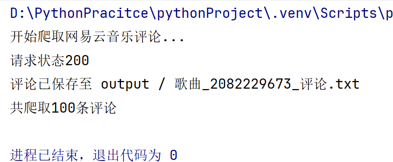
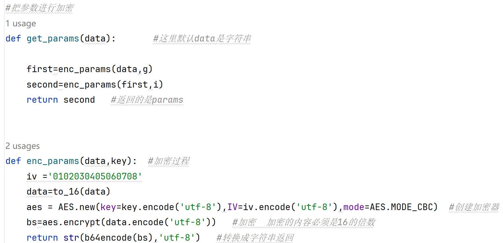
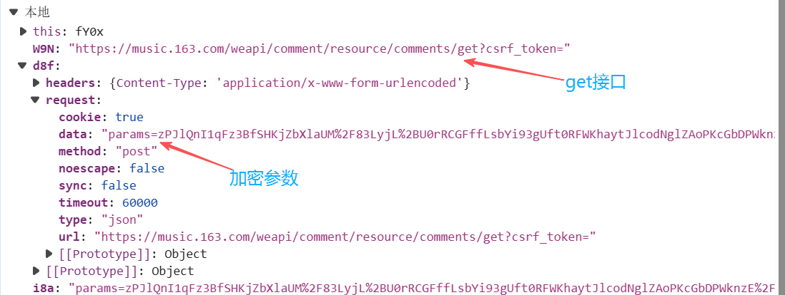
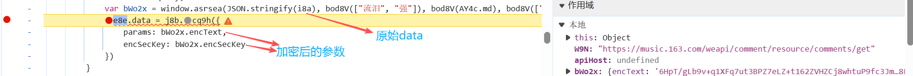
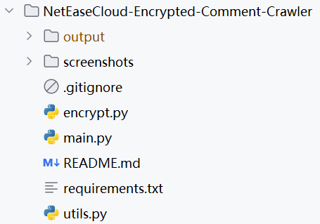

# NetEaseCloud-Encrypted-Comment-Crawler


## 项目简介
本项目针对网易云音乐**AES+RSA双重加密评论接口**开发，通过Chrome断点调试逆向分析JS加密逻辑，纯Requests静态爬取歌曲热门评论，无需浏览器、无界面、高性能。采集的结构化评论数据可直接用于NLP情感分析、用户评论挖掘、文本分类等AI应用场景。

## 技术栈
- Python 3
- Requests 网络请求
- AES + RSA 双重加密算法
- Chrome开发者工具断点调试
- JSON 数据解析与格式化

## 核心功能
- ✅ 破解网易云音乐接口加密参数
- ✅ 单页最大支持100条评论爬取
- ✅ 基于cursor游标分页爬取所有评论
- ✅ 自动格式化评论数据（用户名、内容、时间、点赞数）
- ✅ 自动保存至本地文本文件
- ✅ 全场景异常处理，单页失败不中断整体任务
- ✅ 内置延时防封IP机制
- ✅ 模块化代码结构，易扩展易维护

## 项目结构
```
NetEaseCloud-Encrypted-Comment-Crawler/
├── main.py              # 程序主入口，负责请求与数据解析
├── encrypt.py           # 加密核心模块，实现AES双重加密
├── utils.py             # 工具模块，负责文件保存与数据处理
├── requirements.txt     # 项目依赖清单
├── README.md            # 项目说明文档
├── .gitignore           # Git忽略配置
├── screenshots/         # 项目截图目录
└── output/              # 评论结果保存目录
```

## 运行方式
### 1. 安装依赖
```bash
pip install -r requirements.txt
```

### 2. 配置歌曲ID
打开 `main.py`，修改 `SONG_ID` 为你想要爬取的歌曲ID：
```python
# 示例：爬取歌曲ID为2082229673的评论
SONG_ID = "2082229673"
```

### 3. 运行程序
```bash
python main.py
```

### 4. 查看结果
爬取完成后，评论会自动保存至 `output/歌曲_{SONG_ID}_评论.txt` 文件中。

## 项目运行与原理截图
### 1. 程序运行结果


### 2. AES加密核心代码


### 3. 网易云评论接口抓包


### 4. JS断点调试获取加密参数


### 5. 项目结构


## 核心技术亮点
1. **双重AES加密破解**：逆向还原网易云JS中的两次AES-CBC加密逻辑，实现参数自动加密
2. **固定随机密钥技巧**：通过固定16位随机字符串，绕过复杂的RSA加密实现，简化代码
3. **断点调试逆向**：使用Chrome开发者工具断点调试，精准定位加密函数与参数生成位置
4. **游标分页爬取**：适配网易云cursor分页机制，实现批量评论爬取
5. **工程化规范**：模块化拆分代码，加入超时、重试、异常处理，保证爬虫稳定性

## AI应用扩展
本项目采集的评论数据是天然的NLP训练数据集，可快速扩展为以下AI应用：
- **歌曲评论情感分析**：集成NLP或大模型API，自动分析评论正负向情感
- **热门关键词提取**：使用TF-IDF或TextRank算法，提取歌曲评论中的高频关键词
- **用户评论分类**：训练文本分类模型，对评论进行主题分类（如歌词、旋律、演唱等）
- **歌曲推荐系统**：基于用户评论情感，构建个性化歌曲推荐模型

## 注意事项
1. 本项目仅供学习交流使用，请勿用于商业用途或大规模爬取
2. 请合理控制爬取速度，建议添加1-2秒延时，避免被网易云封禁IP
3. 网易云接口可能会不定期更新，如加密逻辑变更，请通过断点调试重新获取参数
4. 未登录状态下只能爬取公开评论，登录后可获取更多评论内容

## GitHub仓库配置
### About描述
```
Python逆向网易云音乐AES+RSA双重加密接口，批量爬取歌曲热门评论，支持分页爬取，可用于NLP情感分析、用户评论挖掘等AI应用场景。
```

### Topics标签
```
python requests spider aes rsa reverse-engineering netease-cloud-music web-scraping nlp
```